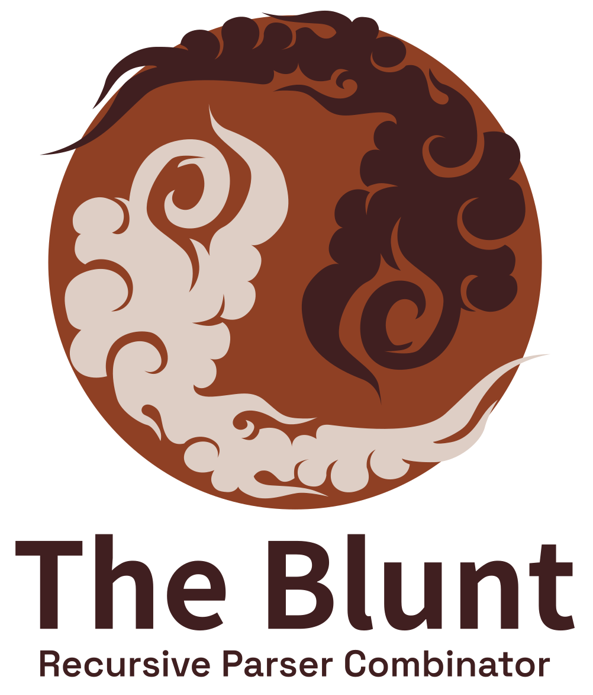

    

A a one-file recursive descent parser combinator library for F# and Fable.

Some Facts and Infos:
---

* It's just another recursive descent parser combinator library
* Focus on parsing string documents
* For sure not made for everything, but may work well for small to medium stuff
* **Performance**
  * Making use of Spans
  * Making use of InlineIfLambda
  * No benchmarks available (yet)
* You can use the CE syntax for many parsers
* No dependencies
* State: Far from complete. It's a "works for me" implementation used in [Trulla Templates](https://github.com/RonaldSchlenker/Trulla)
* **Examples**
  * Have look at [Trulla Templates Parser](https://github.com/RonaldSchlenker/Trulla/blob/main/src/CoreFiles/Parsing.fs)
  * Have a look at the [Tests](./src/Tests/ParserTests.fs)
